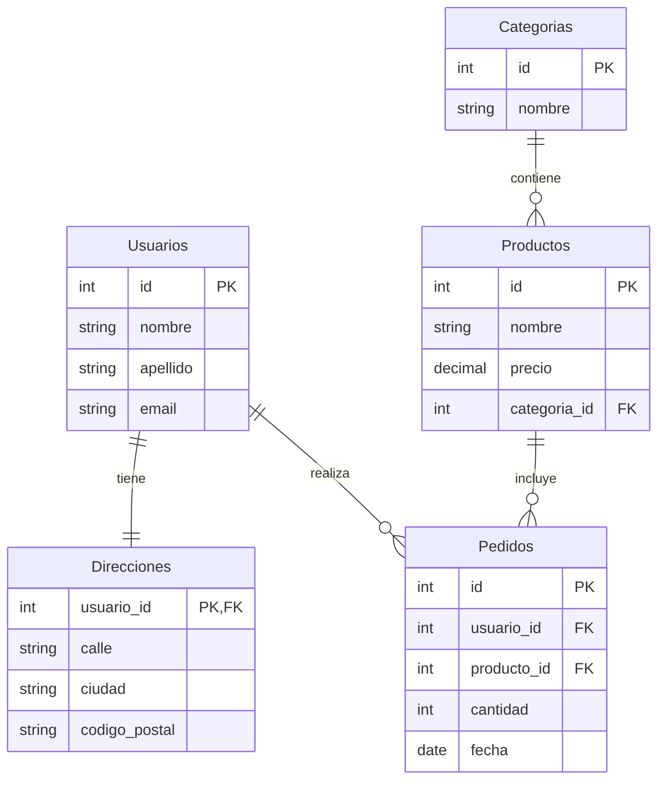
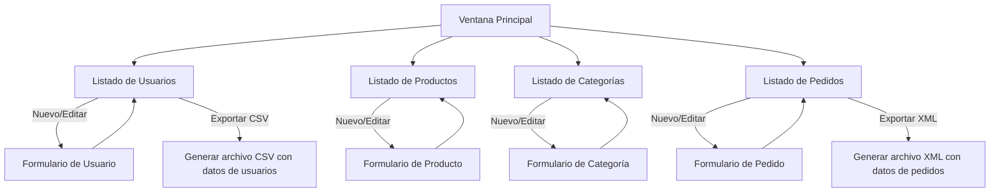
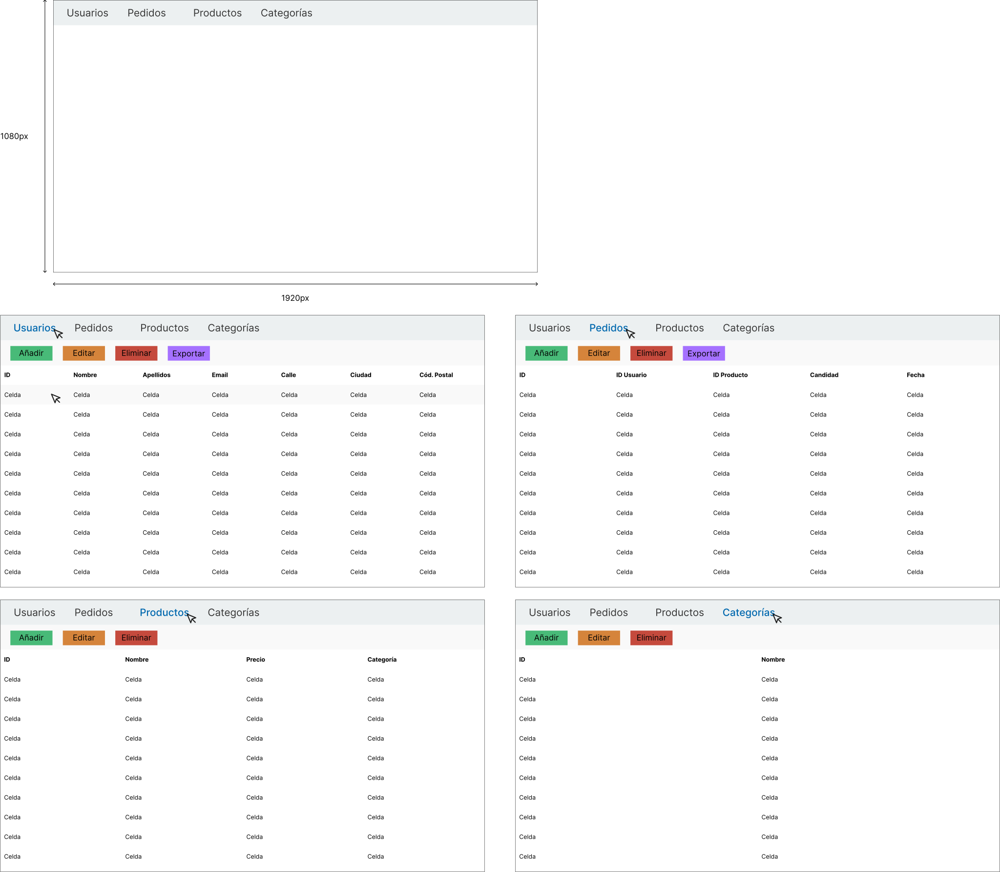
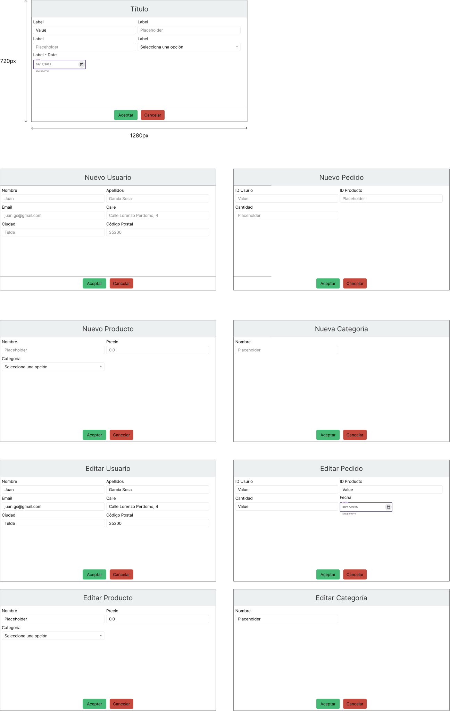
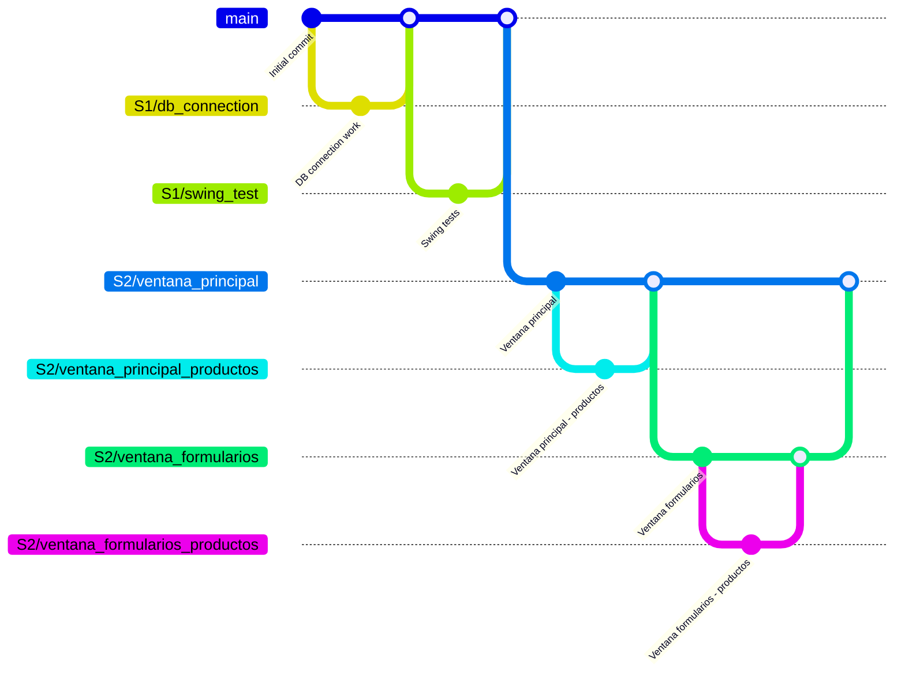

# Proyecto Tienda

> [!NOTE]  
> Este proyecto utiliza Java y Swing para la interfaz gráfica, y sigue el patrón de diseño MVC para una separación clara
entre la lógica de negocio y la interfaz de usuario.
> Asegúrate de tener instalado Java y un IDE compatible (como Eclipse o IntelliJ) para ejecutar el proyecto.
> Además, necesitarás tener MySQL instalado y configurado para la base de datos.

## Índice

1. [Descripción del Proyecto](#descripción-del-proyecto)
2. [Instalación](#instalación)
3. [Base de Datos](#base-de-datos)
   1. [Descripción de las Tablas](#descripción-de-las-tablas)
   2. [Diagrama de Entidad-Relación (ER)](#diagrama-de-entidad-relación-er)
4. [Requisitos Funcionales](#requisitos-funcionales)
5. [Diagrama de Clases UML](#diagrama-de-clases-uml)
6. [Diseño de la Aplicación de Tienda](#diseño-de-la-aplicación-de-tienda)
   1. [Diagrama de Conexiones entre Vistas](#diagrama-de-conexiones-entre-vistas)
   2. [Diagrama de Flujo de la Aplicación](#diagrama-de-flujo-de-la-aplicación)

## Descripción del Proyecto

Este proyecto consiste en una aplicación de escritorio para gestionar una tienda, utilizando Java y Swing. La aplicación
permite realizar operaciones CRUD (Crear, Leer, Actualizar y Eliminar) sobre las entidades de la tienda: Usuarios, Productos,
Categorías y Pedidos. La base de datos está diseñada para almacenar la información necesaria y las relaciones entre las
entidades. La aplicación sigue el patrón de diseño MVC (Modelo-Vista-Controlador) para separar la lógica de negocio de la
interfaz de usuario.

## Instalación

> [!TIP]
> Antes de ejecutar la aplicación, asegúrate de que la base de datos MySQL esté configurada correctamente y que las
tablas estén creadas según el esquema proporcionado.
> Puedes usar herramientas como MySQL Workbench o phpMyAdmin para gestionar la base de datos y verificar que las tablas
estén correctamente creadas.

Para instalar la aplicación, sigue estos pasos:
1. Configura la base de datos MySQL y crea las tablas según el esquema proporcionado.
2. Descarga el código fuente del proyecto.
3. Abre el proyecto en tu IDE favorito (`Eclipse`, `IntelliJ`, etc.).
4. Asegúrate de tener las librerías y dependencias necesarias (`mysql-connector-j-8.2.0.jar`, `Swing`, `JUnit`).
5. Configura la conexión a la base de datos en el código fuente (`src/main/java/dbconnection/DBConnection.java`).
6. Ejecuta la aplicación.

## Base de Datos

> [!IMPORTANT]  
> Configura correctamente la conexión a la base de datos en el archivo `src/main/java/dbconnection/DBConnection.java`
para evitar errores al iniciar la aplicación.
> Asegúrate de que el usuario y la contraseña de la base de datos sean correctos y que el servidor MySQL esté levantado.
> Además, verifica que el puerto de conexión sea el correcto (por defecto es 3306, pero en la configuración está 3307).
> Si cambias el puerto, asegúrate de actualizarlo en la configuración de conexión.

La base de datos está diseñada para almacenar la información de los usuarios, productos, categorías y pedidos. A
continuación se presenta el esquema de la base de datos:

```sql
CREATE DATABASE IF NOT EXISTS Tienda CHARACTER SET utf8mb4 COLLATE utf8mb4_spanish_ci;
USE Tienda;

CREATE TABLE Categorias (
    id INT PRIMARY KEY,
    nombre VARCHAR(50) NOT NULL
);

CREATE TABLE Usuarios (
    id INT PRIMARY KEY,
    nombre VARCHAR(50),
    apellido VARCHAR(50),
    email VARCHAR(100)
);

CREATE TABLE Direcciones (
    usuario_id INT,
    calle VARCHAR(100),
    ciudad VARCHAR(50),
    codigo_postal VARCHAR(10),
    PRIMARY KEY(usuario_id),
    FOREIGN KEY(usuario_id) REFERENCES Usuarios(id)
);

CREATE TABLE Productos (
    id INT PRIMARY KEY,
    nombre VARCHAR(50),
    precio DECIMAL(10,2),
    categoria_id INT,
    FOREIGN KEY(categoria_id) REFERENCES Categorias(id)
);

CREATE TABLE Pedidos (
    id INT PRIMARY KEY,
    usuario_id INT,
    producto_id INT,
    cantidad INT,
    fecha DATE,
    FOREIGN KEY(usuario_id) REFERENCES Usuarios(id),
    FOREIGN KEY(producto_id) REFERENCES Productos(id)
);
```

### Descripción de las Tablas

- **Categorias**: Almacena las categorías de los productos. Cada categoría tiene un ID único y un nombre.
- **Usuarios**: Almacena la información de los usuarios de la tienda. Cada usuario tiene un ID único, nombre, apellido y 
email.
- **Direcciones**: Almacena las direcciones de los usuarios. Cada dirección está asociada a un usuario mediante una clave
foránea (usuario_id). La dirección incluye calle, ciudad y código postal.
- **Productos**: Almacena la información de los productos. Cada producto tiene un ID único, nombre, precio y una clave
foránea (categoria_id) que lo relaciona con una categoría.
- **Pedidos**: Almacena la información de los pedidos realizados por los usuarios. Cada pedido tiene un ID único, una clave
foránea (usuario_id) que lo relaciona con un usuario, una clave foránea (producto_id) que lo relaciona con un producto,
una cantidad y una fecha.
- **Relaciones**: 
  - Un usuario puede tener una o más direcciones (uno a uno).
  - Un producto pertenece a una categoría (uno a uno).
  - Un pedido está asociado a un usuario y un producto (muchos a uno).

### Diagrama de Entidad-Relación (ER)



Este diagrama muestra las entidades y sus relaciones. Las líneas indican la cardinalidad de las relaciones entre las
entidades. Por ejemplo, un usuario puede tener varias direcciones (uno a uno), y un producto pertenece a una categoría
(uno a uno). Además, un usuario puede realizar varios pedidos, y un pedido puede incluir varios productos (muchos a
uno).

## Requisitos Funcionales

1. **Gestión de Usuarios**:
   - Crear, leer, actualizar y eliminar usuarios.
   - Cada usuario tiene un nombre, apellido y email.
   - Cada usuario puede tener una o más direcciones.
2. **Gestión de Productos**:
   - Crear, leer, actualizar y eliminar productos.
   - Cada producto tiene un nombre, precio y categoría.
3. **Gestión de Categorías**:
   - Crear, leer, actualizar y eliminar categorías.
   - Cada categoría tiene un nombre.
4. **Gestión de Pedidos**:
   - Crear, leer, actualizar y eliminar pedidos.
   - Cada pedido está asociado a un usuario y un producto.
   - Cada pedido tiene una cantidad y una fecha.
5. **Exportación de Datos**:
   - Exportar la lista de usuarios a un archivo CSV.
   - Exportar la lista de pedidos a un archivo XML.
6. **Interfaz de Usuario**:
   - La aplicación debe tener una interfaz gráfica amigable y fácil de usar.
   - La interfaz debe seguir el patrón MVC (Modelo-Vista-Controlador).
   - La aplicación debe ser capaz de manejar errores y mostrar mensajes al usuario.
7. **Validaciones**:
   - Validar que los campos obligatorios no estén vacíos.
   - Validar el formato del email.
   - Validar que el código postal sea numérico.
   - Validar que la cantidad de productos sea un número positivo.
8. **Conexión a Base de Datos**:
   - La aplicación debe conectarse a una base de datos MySQL.
   - La conexión debe ser segura y manejar errores de conexión.
   - La aplicación debe cerrar la conexión a la base de datos al finalizar.
9. **Documentación**:
   - La aplicación debe estar documentada con comentarios en el código.
   - Incluir un README con instrucciones de instalación y uso.
   - Incluir un diagrama de entidad-relación (ER) y un diagrama de flujo de la aplicación.
   - Incluir un diagrama de clases UML que represente la estructura de la aplicación.
   - Incluir un diagrama de conexiones entre vistas que muestre la navegación entre las diferentes secciones de la aplicación.
10. **Pruebas**:
    - Incluir pruebas unitarias para las funciones principales de la aplicación.
    - Incluir pruebas de integración para verificar la conexión a la base de datos y las operaciones CRUD.
    - Incluir pruebas funcionales para verificar el correcto funcionamiento de la interfaz de usuario.
11. **Manejo de Errores**:
    - La aplicación debe manejar errores de forma adecuada y mostrar mensajes al usuario.
    - Incluir manejo de excepciones para las operaciones de base de datos.
    - Incluir manejo de errores para la exportación de archivos (CSV y XML).
12. **Interacción con el Usuario**:
    - La aplicación debe permitir al usuario interactuar de forma intuitiva.
    - Incluir mensajes de confirmación para acciones críticas (eliminación de registros).
    - Incluir mensajes de éxito al realizar operaciones exitosas (guardar, eliminar, etc.).
13. **Estilo y Diseño**:
    - La aplicación debe tener un diseño limpio y profesional.
    - Incluir iconos y estilos visuales que mejoren la experiencia del usuario.
    - Utilizar colores y fuentes que sean agradables a la vista.
    - Incluir un menú de navegación persistente para acceder a las diferentes secciones de la aplicación.

## Diagrama de Clases UML

```mermaid
```

## Diseño de la Aplicación de Tienda

La aplicación sigue el patrón MVC. La Ventana Principal contiene un menú de navegación persistente para acceder a cada
sección (Usuarios, Productos, Categorías, Pedidos). Cada sección tiene su propia vista (lista) y formularios para CRUD.

A continuación se detalla cada vista necesaria:

| **Vista (Nombre)**        | **Componentes (Swing)**                                                                                                                                                                                                               | **Comportamientos esperados**                                                                                                                                                                                                                                                                                                                                                                                                                                                                                                                                                                                                                                                                                                                                                                                                                                                                                                                                                                                                                 |
|---------------------------|---------------------------------------------------------------------------------------------------------------------------------------------------------------------------------------------------------------------------------------|-----------------------------------------------------------------------------------------------------------------------------------------------------------------------------------------------------------------------------------------------------------------------------------------------------------------------------------------------------------------------------------------------------------------------------------------------------------------------------------------------------------------------------------------------------------------------------------------------------------------------------------------------------------------------------------------------------------------------------------------------------------------------------------------------------------------------------------------------------------------------------------------------------------------------------------------------------------------------------------------------------------------------------------------------|
| **Ventana Principal**     | <ul><li>JFrame principal con `JMenuBar`:</li><li>Menú “Usuarios”</li><li>Menú “Productos”</li><li>Menú “Categorías”</li><li>Menú “Pedidos”</li><li>Panel de contenido (p.ej. `JPanel` con *CardLayout* o `JDesktopPane`)</li></ul>    | <ul><li>Al iniciar la aplicación: conectar a BD y mostrar vista por defecto (p.ej. listado de usuarios o pantalla inicial).</li><li>Al seleccionar cada menú: cargar la vista correspondiente (lista de Usuarios, Productos, Categorías o Pedidos) en el panel de contenido.</li><li>El menú “Salir” (si existe) cierra la app tras confirmar con `JOptionPane`.</li></ul>                                                                                                                                                                                                                                                                                                                                                                                                                                                                                                                                                                                                                                                                    |
| **Listado de Usuarios**   | <ul><li>`JTable` con columnas: ID, Nombre, Apellido, Email, (opcional: Ciudad/Código Postal)</li><li>Botones: “Nuevo Usuario”, “Editar Usuario”, “Eliminar Usuario”, “**Exportar CSV**”.</li><li>Campo de búsqueda/filtrado</li></ul> | <ul><li>Al abrir: ejecutar `SELECT id, nombre, apellido, email FROM Usuarios` (se puede hacer `JOIN` con *Direcciones* para mostrar ciudad) y poblar la tabla.</li><li>**Nuevo Usuario**: abre *Formulario Usuario* en modo creación.</li><li>**Editar Usuario**: al tener fila seleccionada, abre formulario con datos del usuario (y su dirección).</li><li>**Eliminar Usuario**: confirma con `JOptionPane`. Si confirma, primero elimina fila de **Direcciones** (`DELETE FROM Direcciones WHERE usuario_id=?`), luego de **Usuarios** (`DELETE FROM Usuarios WHERE id=?`). Si hay error (p.ej. restricción de FK o ningún usuario seleccionado), mostrar mensaje de error.</li><li>Tras cada acción (crear/editar/eliminar) refrescar la lista ejecutando nuevamente la consulta SQL.</li><li>**Exportar CSV**: genera un archivo CSV con los datos de la tabla de usuarios, con columnas separadas por comas (p.ej. `ID,Nombre,Apellido,Email,...`).</li></ul>                                                                          |
| **Formulario Usuario**    | <ul><li>Etiquetas y `JTextField` para: Nombre, Apellido, Email.</li><li>Etiquetas y `JTextField` para Dirección: Calle, Ciudad, Código Postal.</li><li>Botones: “Guardar”, “Cancelar”.</li></ul>                                      | <ul><li>Modo **Nuevo**: todos los campos vacíos. Modo **Editar**: cargar campos con `SELECT * FROM Usuarios u JOIN Direcciones d ON u.id=d.usuario_id WHERE u.id = ?`.</li><li>Al presionar **Guardar**: validar que Nombre, Apellido, Email, Calle, Ciudad y Código Postal no estén vacíos; validar formato de email y que Código Postal sea numérico. Si falla validación, mostrar `JOptionPane` de error.</li><li>Si válido: en **Nuevo**, insertar en **Usuarios** (`INSERT INTO Usuarios (id,nombre,apellido,email) VALUES(...)`) y en **Direcciones** (`INSERT INTO Direcciones (usuario_id,calle,ciudad,codigo_postal) VALUES(...)`). En **Editar**, ejecutar `UPDATE Usuarios SET nombre=?, apellido=?, email=? WHERE id=?` y `UPDATE Direcciones SET calle=?, ciudad=?, codigo_postal=? WHERE usuario_id=?`.</li><li>Después de guardar correctamente, mostrar mensaje de confirmación y cerrar el formulario (o volver al listado) refrescando la lista de usuarios.</li><li>**Cancelar**: cerrar formulario sin cambios.</li></ul> |
| **Listado de Productos**  | <ul><li>`JTable` con columnas: ID, Nombre, Precio, Categoría.</li><li>Botones: “Nuevo Producto”, “Editar Producto”, “Eliminar Producto”.</li></ul>                                                                                    | <ul><li>Al abrir: ejecutar `SELECT p.id, p.nombre, p.precio, c.nombre AS categoria FROM Productos p JOIN Categorias c ON p.categoria_id = c.id` y poblar tabla.</li><li>**Nuevo Producto**: abre *Formulario Producto* (campos vacíos).</li><li>**Editar Producto**: abre formulario con datos del producto seleccionado.</li><li>**Eliminar Producto**: confirma con `JOptionPane`. Si confirma, ejecutar `DELETE FROM Productos WHERE id=?`. Si el producto está referenciado en **Pedidos**, la base dará error por FK; capturarlo y mostrar mensaje (“No se puede eliminar: existen pedidos asociados”).</li><li>Tras la acción, refrescar tabla de productos.</li></ul>                                                                                                                                                                                                                                                                                                                                                                  |
| **Formulario Producto**   | <ul><li>Etiquetas y `JTextField` para: Nombre, Precio.</li><li>`JComboBox` para seleccionar Categoría (carga nombres de **Categorias**).</li><li>Botones: “Guardar”, “Cancelar”.</li></ul>                                            | <ul><li>Al abrir: cargar lista de categorías (`SELECT id, nombre FROM Categorias`) en el `JComboBox`.</li><li>Modo **Nuevo**: campos vacíos, `JComboBox` por defecto (p.ej. “Seleccione”). Modo **Editar**: cargar datos (`SELECT nombre, precio, categoria_id FROM Productos WHERE id=?`) y seleccionar la categoría correspondiente.</li><li>**Guardar**: validar Nombre no vacío, Precio numérico >0, y categoría seleccionada. Si falla, mostrar error.</li><li>Si válido: en **Nuevo**, `INSERT INTO Productos (id,nombre,precio,categoria_id) VALUES(...)`. En **Editar**, `UPDATE Productos SET nombre=?, precio=?, categoria_id=? WHERE id=?`.</li><li>Tras guardar, confirmar y cerrar, refrescando la lista de productos.</li><li>**Cancelar**: cerrar sin guardar.</li></ul>                                                                                                                                                                                                                                                       |
| **Listado de Categorías** | <ul><li>`JTable` con columnas: ID, Nombre.</li><li>Botones: “Nueva Categoría”, “Editar Categoría”, “Eliminar Categoría”.</li></ul>                                                                                                    | <ul><li>Al abrir: `SELECT id, nombre FROM Categorias` y poblar tabla.</li><li>**Nueva Categoría**: abre *Formulario Categoría* (campo nombre vacío).</li><li>**Editar Categoría**: abre formulario con nombre de la categoría seleccionada.</li><li>**Eliminar Categoría**: confirma con `JOptionPane`. Si confirma, primero ejecutar `SELECT COUNT(*) FROM Productos WHERE categoria_id = ?`; si el resultado >0, mostrar error (“No se puede eliminar: existen productos asociados”); en caso contrario, ejecutar `DELETE FROM Categorias WHERE id=?`.</li><li>Tras acción, refrescar lista de categorías (y actualizar los `JComboBox` de categorías en productos si aplicable).</li></ul>                                                                                                                                                                                                                                                                                                                                                 |
| **Formulario Categoría**  | <ul><li>Etiqueta y `JTextField` para Nombre.</li><li>Botones: “Guardar”, “Cancelar”.</li></ul>                                                                                                                                        | <ul><li>Modo **Nuevo**: nombre vacío. Modo **Editar**: cargar nombre existente (`SELECT nombre FROM Categorias WHERE id=?`).</li><li>**Guardar**: validar que el nombre no esté vacío. Si falla, mostrar error.</li><li>Si válido: en **Nuevo**, `INSERT INTO Categorias (id,nombre) VALUES(...)`. En **Editar**, `UPDATE Categorias SET nombre=? WHERE id=?`.</li><li>Tras guardar, confirmar y cerrar, refrescando la lista de categorías.</li><li>**Cancelar**: cerrar sin cambios.</li></ul>                                                                                                                                                                                                                                                                                                                                                                                                                                                                                                                                              |
| **Listado de Pedidos**    | <ul><li>`JTable` con columnas: ID, Usuario, Producto, Cantidad, Fecha.</li><li>Botones: “Nuevo Pedido”, “Editar Pedido”, “Eliminar Pedido”, "Exportar XML".</li><li>Campo de búsqueda/filtrado</li></ul>                              | <ul><li>Al abrir: `SELECT o.id, u.nombre AS usuario, p.nombre AS producto, o.cantidad, o.fecha FROM Pedidos o JOIN Usuarios u ON o.usuario_id=u.id JOIN Productos p ON o.producto_id=p.id`.</li><li>**Nuevo/Editar**: abre formulario de pedido (selección de usuario y producto, ingreso de cantidad y fecha) y ejecuta INSERT/UPDATE en **Pedidos**.</li><li>**Eliminar**: confirma y ejecuta `DELETE FROM Pedidos WHERE id=?`.</li><li>**Exportar XML**: genera un archivo XML con los datos de la tabla de pedidos, estructurado según el esquema definido (p.ej. <pedidos><pedido><id>1</id><usuario>Juan</usuario>...</pedido></pedidos>).</li></ul>                                                                                                                                                                                                                                                                                                                                                                                    |
| **Formulario Pedido**     | <ul><li>Etiquetas y `JComboBox` para seleccionar Usuario y Producto.</li><li>`JTextField` para Cantidad y Fecha.</li><li>Botones: “Guardar”, “Cancelar”.</li></ul>                                                                    | <ul><li>Modo **Nuevo**: campos vacíos, `JComboBox` por defecto (p.ej. “Seleccione”). Modo **Editar**: cargar datos (`SELECT usuario_id, producto_id, cantidad, fecha FROM Pedidos WHERE id=?`) y seleccionar los valores correspondientes.</li><li>**Guardar**: validar que Usuario y Producto estén seleccionados, Cantidad sea numérica >0, y Fecha tenga formato válido. Si falla, mostrar error.</li><li>**Validación**: en **Nuevo**, `INSERT INTO Pedidos (id,usuario_id,producto_id,cantidad,fecha) VALUES(...)`; en **Editar**, `UPDATE Pedidos SET usuario_id=?, producto_id=?, cantidad=?, fecha=? WHERE id=?`.</li><li>Tras guardar, confirmar y cerrar, refrescando la lista de pedidos.</li><li>**Cancelar**: cerrar sin guardar.</li></ul>                                                                                                                                                                                                                                                                                      |
| **Exportar Archivos**     | <ul><li>`JTextField` para: Ubicación para guardar el archivo</li></ul>                                                                                                                                                                | <ul><li>**Exportar CSV**: al seleccionar, abrir un diálogo para elegir la ubicación del archivo CSV. Generar el archivo con la siguiente sintaxis: `usuarios_[año][mes][día]_[hora][minutos][segundos].xml`.</li><li>**Exportar XML**: al seleccionar, abrir un diálogo para elegir la ubicación del archivo XML. Generar el archivo con la siguiente sintaxis: `pedidos_[año][mes][día]_[hora][minutos][segundos].xml`.</li></ul>                                                                                                                                                                                                                                                                                                                                                                                                                                                                                                                                                                                                            |

En todas las vistas de formulario se usan JOptionPane para confirmar acciones o mostrar errores (p.ej. al validar campos
o al confirmar eliminación). Se aplican validaciones básicas en cada formulario (campos obligatorios, formatos, unicidad
si aplica) y se actualizan las vistas padre tras cualquier cambio en la base de datos. La relación uno-a-uno
Usuario-Dirección se implementa asegurando que al crear o editar un usuario también se inserte/actualice su dirección
correspondiente. Asimismo, la relación Producto-Categoría se gestiona mediante las claves foráneas definidas en la BD:
al crear/editar un producto se asigna una categoría existente.

### Diagrama de Conexiones entre Vistas



Este diagrama muestra que la Ventana Principal (A) permite navegar a los listados de Usuarios (B), Productos (C),
Categorías (D) y Pedidos (E) mediante el menú persistente. Desde cada listado se puede acceder al formulario de
alta/edición correspondiente (Formulario de Usuario F, Producto G, Categoría H, Pedido I) a través de las acciones
“Nuevo” o “Editar”. Al guardar o cancelar en cada formulario, se regresa al listado correspondiente (flechas de
retorno). Además, desde los listados de Usuarios y Pedidos se pueden exportar los datos a archivos CSV o XML,
respectivamente. Todos los formularios y listas respetan la arquitectura MVC: la vista interactúa con controladores que
ejecutan las consultas SQL y actualizan el modelo.

### Diagrama de Flujo de la Aplicación

```mermaid 
flowchart TD
    Start((Inicio))
    Start --> ConnectDB[Conectar a BD]
    ConnectDB --> ShowMain[Mostrar Ventana Principal]
    ShowMain --> MenuOptions["Seleccionar Opción del Menú"]
    MenuOptions -->|Usuarios| UserList[Listado de Usuarios]
    MenuOptions -->|Productos| ProdList[Listado de Productos]
    MenuOptions -->|Categorías| CatList[Listado de Categorías]
    MenuOptions -->|Pedidos| OrderList[Listado de Pedidos]
    
    %% Flujo de Usuarios
    UserList -->|Nuevo Usuario| UserForm[Formulario de Usuario - con campos de dirección]
    UserForm -->|Guardar| SaveUser[Validar y ejecutar INSERT Usuarios + Direcciones]
    UserForm -->|Cancelar| UserList
    SaveUser --> UserList
    UserList -->|Editar Usuario| UserForm
    UserList -->|Eliminar Usuario| ConfirmUserDel[Confirmar con JOptionPane]
    ConfirmUserDel -->|Sí| DeleteUser[Ejecutar DELETE en Direcciones y Usuarios]
    DeleteUser --> UserList
    UserList -->|Exportar CSV| ExportCSV[Generar archivo CSV con datos de usuarios]
    ExportCSV --Ubicación--> UserList

    %% Flujo de Productos
    ProdList -->|Nuevo Producto| ProdForm[Formulario de Producto - con categoría]
    ProdForm -->|Guardar| SaveProd[Validar y ejecutar INSERT Productos]
    ProdForm -->|Cancelar| ProdList
    SaveProd --> ProdList
    ProdList -->|Editar Producto| ProdForm
    ProdList -->|Eliminar Producto| ConfirmProdDel[Confirmar con JOptionPane]
    ConfirmProdDel -->|Sí| CheckPedido[Verificar que no existan Pedidos con ese producto]
    CheckPedido -->|Ninguno| DeleteProd[Ejecutar DELETE en Produtos]
    CheckPedido -->|Existen| ErrorDelProd[Mostrar error y abortar]
    DeleteProd --> ProdList
    ErrorDelProd --> ProdList

    %% Flujo de Categorías
    CatList -->|Nueva Categoría| CatForm[Formulario de Categoría]
    CatForm -->|Guardar| SaveCat[Validar y ejecutar INSERT Categorías]
    CatForm -->|Cancelar| CatList
    SaveCat --> CatList
    CatList -->|Editar Categoría| CatForm
    CatList -->|Eliminar Categoría| ConfirmCatDel[Confirmar con JOptionPane]
    ConfirmCatDel -->|Sí| CheckProducts[Verificar que no existan Productos con esa categoría]
    CheckProducts -->|Ninguno| DeleteCat[Ejecutar DELETE en Categorías]
    CheckProducts -->|Existen| ErrorDelCat[Mostrar error y abortar]
    DeleteCat --> CatList
    ErrorDelCat --> CatList

    %% Flujo de Pedidos (simplificado)
    OrderList -->|Nuevo Pedido| OrderForm[Formulario de Pedido]
    OrderForm -->|Guardar| SaveOrder[Validar y ejecutar INSERT Pedidos]
    OrderForm -->|Cancelar| OrderList
    SaveOrder --> OrderList
    OrderList -->|Editar Pedido| OrderForm
    OrderList -->|Eliminar Pedido| ConfirmOrderDel[Confirmar con JOptionPane]
    ConfirmOrderDel -->|Sí| DeleteOrder[Ejecutar DELETE en Pedidos]
    DeleteOrder --> OrderList
    OrderList -->|Exportar XML| ExportXML[Generar archivo XML con datos de pedidos]
    ExportXML --Ubicación--> OrderList

    %% Fin de Aplicación
    ShowMain -->|Cerrar Aplicación| End((Cierre))
```



Este diagrama de flujo muestra el ciclo de la aplicación desde el inicio hasta el cierre. Tras iniciar y conectar a la
base de datos, se muestra la ventana principal. El usuario elige una opción del menú (“Usuarios”, “Productos”,
“Categorías” o “Pedidos”), lo que despliega el correspondiente listado. En cada listado se puede crear, editar, eliminar
o exportar registros según corresponda:

* **Usuarios**: Al crear o editar, se abre el formulario que incluye campos de dirección. Al guardar, se validan los datos y
se ejecutan las sentencias `INSERT` o `UPDATE` en las tablas **Usuarios** y **Direcciones**. Al eliminar, se solicita confirmación y
se borran los registros correspondientes (primero en **Direcciones**, luego en **Usuarios**). Además, se puede exportar la lista
de usuarios a un archivo CSV.

* **Productos**: Al crear/editar, el formulario permite ingresar nombre, precio y seleccionar una categoría (foránea según
**Categorias**). El guardado realiza un `INSERT`/`UPDATE` en **Productos**. Al eliminar, se confirma y se ejecuta `DELETE`; si hay
pedidos asociados, la base impide la acción.

* **Categorías**: El formulario solo pide un nombre. Al eliminar, se verifica que no existan productos asociados (consulta
previa), para evitar violar la FK de **Productos**. Si todo es válido, se ejecuta `DELETE`.

* **Pedidos**: Se gestiona de forma análoga, permitiendo asignar un usuario y producto existentes al crear o editar un pedido.
Además, se puede exportar la lista de pedidos a un archivo XML.

En cada paso se muestran diálogos de éxito o error con `JOptionPane` y, tras cada operación de base de datos, la vista de
lista correspondiente se actualiza mostrando los cambios. De esta forma se garantiza que las relaciones entre tablas (
**Usuario–Dirección** y **Producto–Categoría**) se mantengan correctamente en la interfaz y en la base de datos.

### Figma
El diseño de la interfaz gráfica se realizó utilizando Figma, al cual se puede acceder desde el siguiente enlace:
- [Figma - Proyecto Tienda](https://www.figma.com/design/jQd6LendJFD7W6uMXubwSV/Tienda?node-id=0-1&t=vT0lWk0I6M9R12VF-1)

#### Info y Componentes


#### Ventana Principal


#### Formularios de adición y edición


## Mapa de Git

